# OS-project
Linux系统监视器及模拟文件系统 - 华中科技大学操作系统课程设计

## Linux系统监视器

### 系统基本信息获取与显示

1. 从/proc/sys/kernel/hostname文件中Hostname行获取主机名称并显示。
2. 从/proc/uptime文件中第一个参数获取从系统启动到现在的时间并显示，由time(&nowtime);p = localtime(&nowtime); i_time = p->tm_hour*3600 + p->tm_min*60+p->tm_sec函数获取系统当前时间并显示，再由系统当前时间减去从启动到现在的时间得到系统启动时间并显示。
3. 从/proc/sys/kernel/ostype和/proc/sys/kernel/osrelease文件中获取并显示系统的版本号。
4. 从/proc/cpuinfo文件中的model name行中获取并显示cpu的型号和主频大小。

### 所有进程的部分信息的实时显示

1. 打开/proc文件夹，遍历该文件夹中的所有文件，然后当读取到的是"."或者".."则跳过，读取到的不是文件夹名字也跳过，打开每个文件夹中的status文件，找到Name，Pid，PPid，State，VmSize字符串所在的行，分别获得进程名，进程pid，用户名，然后通过QT中的TableWidget显示出来。
2. 读取进程文件夹的stat文件，读取核心时间、硬盘IO时间、其他等待时间等参数，计算进程的CPU占用率，并利用信号和槽机制在列表中显示出来。

### cpu使用率的实时显示

/proc/stat的第一行的各个参数从前往后依次为user，nice，system，idle，iowait，irq，softirq。

* user：从系统启动开始累计到当前时刻，处于用户态的运行时间，不包含 nice值为负进程； 
* nice ：从系统启动开始累计到当前时刻，nice值为负的进程所占用的CPU时间； 
* system：从系统启动开始累计到当前时刻，处于核心态的运行时间； 
* idle ：从系统启动开始累计到当前时刻，除IO等待时间以外的其它等待时间； 
* iowait ：从系统启动开始累计到当前时刻，IO等待时间； 
* irq ：从系统启动开始累计到当前时刻，硬中断时间； 
* softirq：从系统启动开始累计到当前时刻，软中断时间；

则总CPU利用率为记下当前时刻的各个时间值。
总CPU时间：all = atoi(user) + atoi(nice) + atoi(sys) + atoi(idle_char) + atoi(iowait) + atoi(irq) + atoi(softirq);
空闲时间：idle = atoi(idle_char);
一秒前的总CPU时间为all_pre，空闲时间为idle_pre；
使用率：usage = (float)(all - all_pre - (idle -idle_pre)) / (all -all_pre )*100 ;
每个一秒进行一次采样，计算该一秒内CPU的利用率，并通过进度条显示CPU利用率的实时变化。

### 内存使用率的实时显示

/proc/meminfo的MemTotal，MemFree所在的行分别为内存总大小，空闲内存大小，则内存使用率mem_rate = (float)(100 * (mm_total - mm_free) / mm_total);同样每一秒进行一次采样，计算当前的内存使用率，并通过进度条实时显示出来。

### 网络状态的实时显示

/proc/net/dev中以wlp开头的行记录无线网络状态，以enp开头的行记录有线网络状态。其中，Receive列显示接收数据的信息，Transmit列显示发送数据的信息 。bytes列表示接收或发送的字节数，packets列表示接收或发送的packet数。每一秒进行一次采样，计算这一秒内接收数据的平均速度作为实时的接收/下载速度，发送数据的平均速度作为实时的发送/上传速度。同时显示系统启动以来接收和发送的总字节数。

### Screenshot

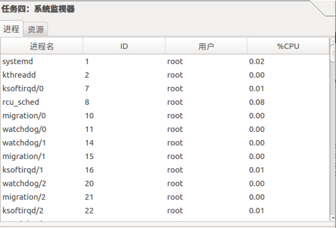

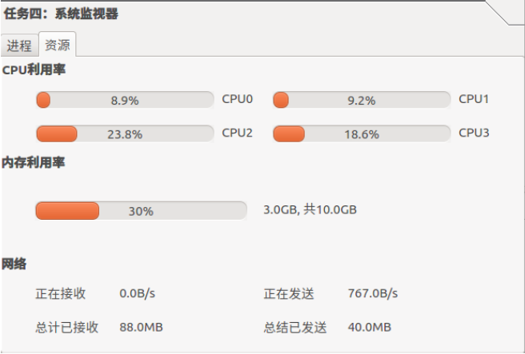

## 模拟文件系统

### 磁盘管理

申请一个100MB的文件，该文件的存储空间就是模拟文件系统的存储空间。以512B作为盘块大小，用以分配的基本单位。采用位示图管理磁盘空间，标记模拟文件系统的所有盘块的使用情况。分配磁盘空间时采用连续分配的方式，划定大小符合要求的连续盘块给文件使用。

1. 系统初始化。如果是第一次启动，则创建一个100MB的空文件，并初始化位示图，创建空的i节点表，创建根目录i节点，将当前目录i节点指向根目录i节点；否则打开存储模拟文件系统的文件，读取位示图信息，读取i节点表信息，初始化根目录和当前目录i节点。
2. 获取指定大小的磁盘空间。从前往后扫描位示图，查找符合要求大小的连续盘块空间，如果找到了，则返回起始盘块号，并将位示图中对应字节改为‘1’，表明被占用，否则返回-1。
3. 释放磁盘空间。从起始盘块号开始，将指定大小的盘块区域对应的位示图改为‘0’,表示空闲。
4. 退出文件系统。把i节点表、位示图、所有盘块的数据写到文件中，释放文件系统申请的内存空间。

### 文件管理

定义了i节点、文件目录项、当前路径等数据结构，实现了系统对于文件和目录的管理，为用户界面模块提供了创建文件、删除文件、创建文件夹、删除文件夹、改变当前目录、重命名、移动文件/文件夹、打开文件、打印当前目录等接口。

* 创建文件。创建i节点，分配磁盘空间，在当前目录文件中插入新文件对应的目录项。
* 删除文件(文件夹)。从当前目录的目录文件中删除文件（文件夹）的目录项，递归地删除i节点、删除i节点对应的目录项、释放磁盘空间。
* 创建文件夹。创建目录文件的i节点，分配磁盘空间，在当前目录文件中插入新的目录文件对应的目录项。
* 改变当前目录。如果是‘.’，表明是当前目录，直接返回；如果是‘..’，path路径的目录项出栈，栈顶则为新的当前目录。如果路径的第一个 字符是‘/’，表明是绝对路径，将根目录设为当前目录，逐级解析绝对路径，查找目录文件中的目录项，找到匹配的目录项则递归地进入下级目录，目录项入栈，直到路径解析完毕为止；否则表明是相对路径，当前目录不变，逐级解析相对路径，查找目录文件中的目录项，找到匹配的目录项则递归地进入下级目录，目录项入栈，直到路径解析完毕。
* 打印当前路径。从path的目录项栈的栈底开始，逐级打印栈中保存的目录项中的文件名，直到栈顶。
* 重命名文件(文件夹)。在当前目录文件中查找文件（文件夹）对应的目录项，修改该目录项的文件名为新的文件名即可。
* 打开文件。在当前目录文件中找到文件对应的目录项，得到对应的i节点信息，根据文件大小判断该文件是直接索引结构、一级间接索引还是二级间接索引。然后通过索引结构读取文件存储的盘块中的数据，已经读取的数据字节数等于文件大小时读取结束。用户编辑完成后保存，用户界面模块首先计算出需要保存的数据的总大小，根据字节数判断应该用几级索引结构保存，然后按照Unix 7文件系统的索引结构规则将数据保存在对应的盘块中。最后修改i节点中的文件大小。
* 移动文件(文件夹)。首先在当前目录文件中找到文件对应的目录项，获取文件的i节点号和文件名，并删除当前目录文件中的该目录项。然后改变当前目录到目的路径，在目录文件中插入文件的目录项。

### 用户界面

* 文件目录树。从模拟文件系统的根目录i节点开始，逐级向下递归地生成目录的树结构。查找根目录i节点对应的目录文件，如果存在一个目录项，则生成根目录下的一个文件（或文件夹），利用QTreeWidget控件生成对应的列，并得到该文件（或文件夹）的i节点号，如果是普通文件则查找下一个目录项，否则递归生成文件夹下的文件树。在文件目录树上右击弹出菜单，可输入绝对路径和文件名创建对应位置的文件或文件夹，即调用文件管理模块创建文件和文件夹的接口并重新生成文件目录树。
* 文件管理器。初始时当前目录位于根目录，文件管理器中显示根目录下的所有文件和文件夹。因此文件管理器的初始化只需要查找根目录下的所有目录项，不需要递归生成下级目录结构。利用QTableWidget控件并作适当美化，可以每行显示一个文件的文件名、文件大小、所有者、上次修改时间等信息。用户双击文件夹所在的行时，会触发QTableWidget的一个事件，调用槽函数显示该文件夹下的所有文件，并将当前目录切换到该文件夹下。同样的，右击弹出菜单进行创建文件、文件夹。在对应文件所在的行上右击还可以进行文件删除、重命名、移动文件等操作。双击普通文件，会弹出一个自定义的简易编辑器显示文件内容，并进行文件的编辑，点击保存后自动写入磁盘中，并改写i节点中的信息。

### Screenshot

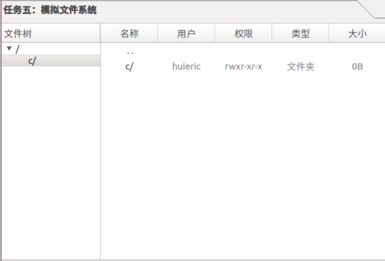

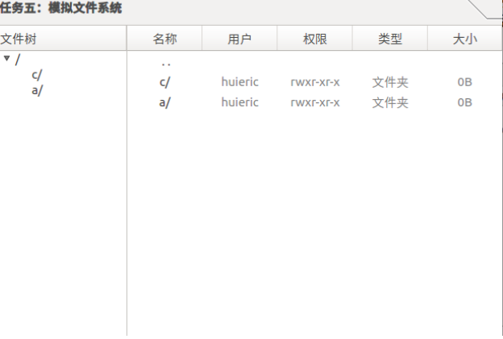

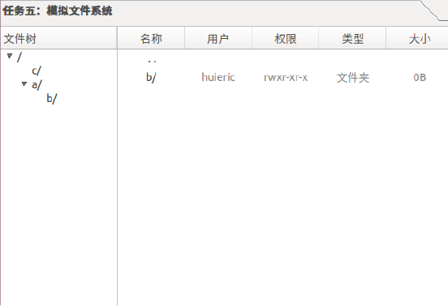

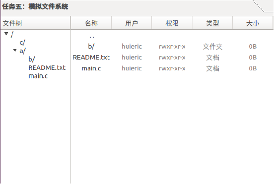

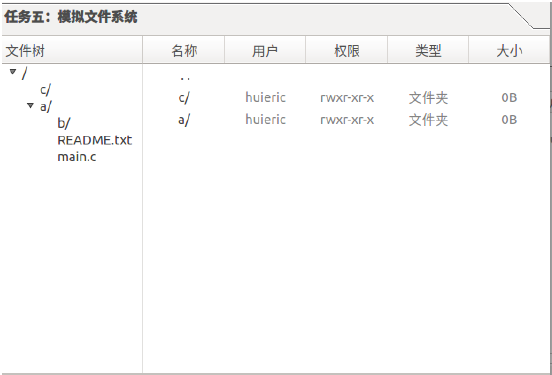

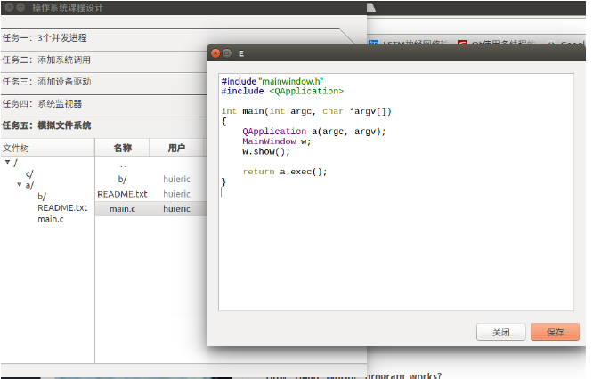

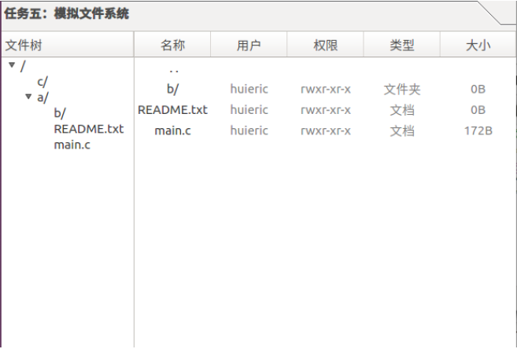

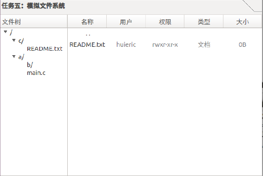

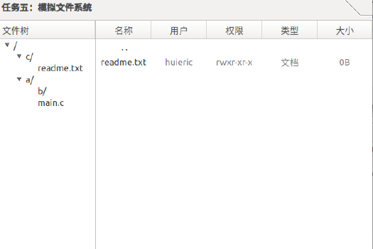

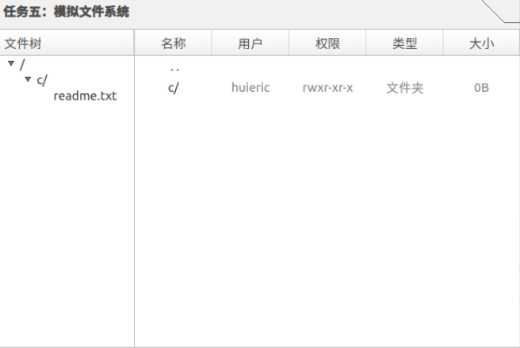

